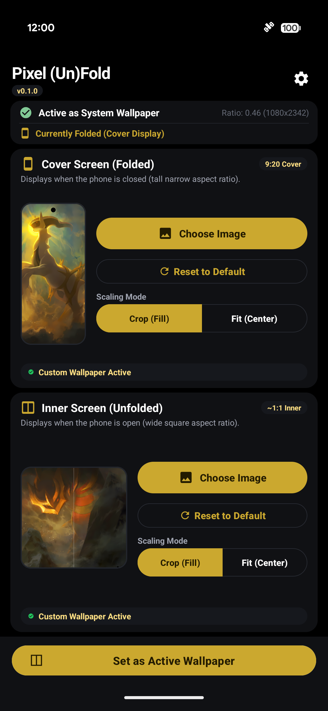
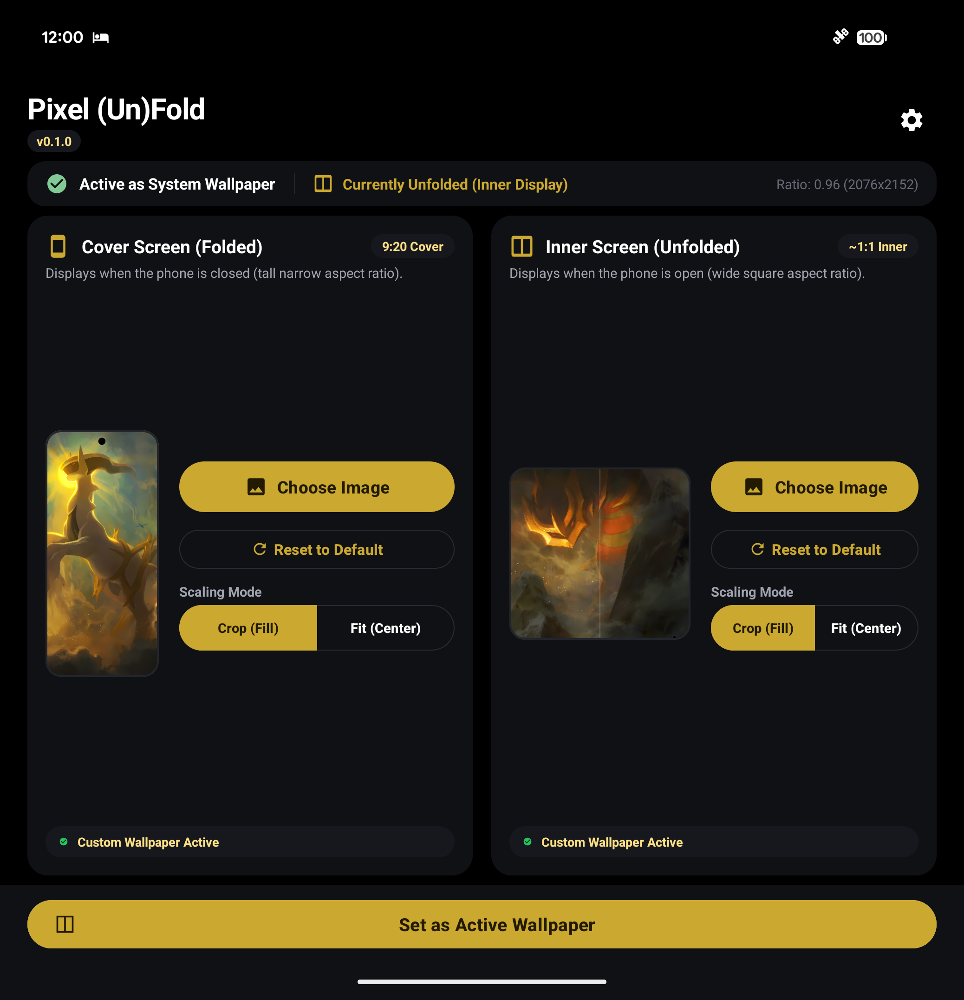
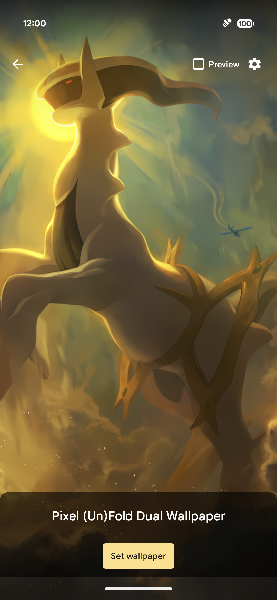
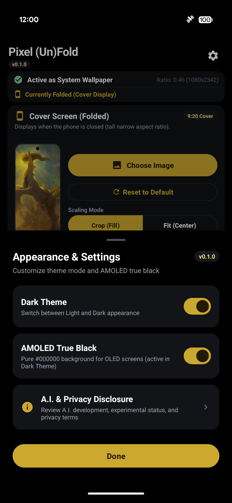
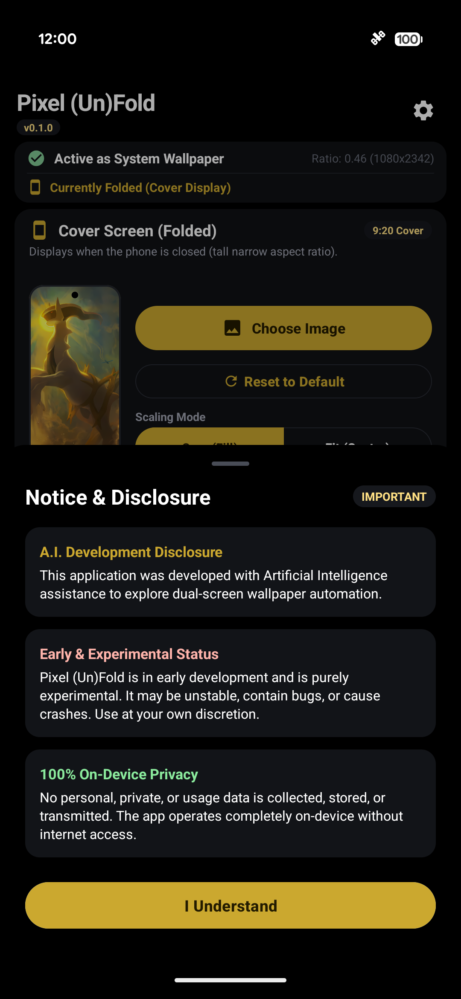
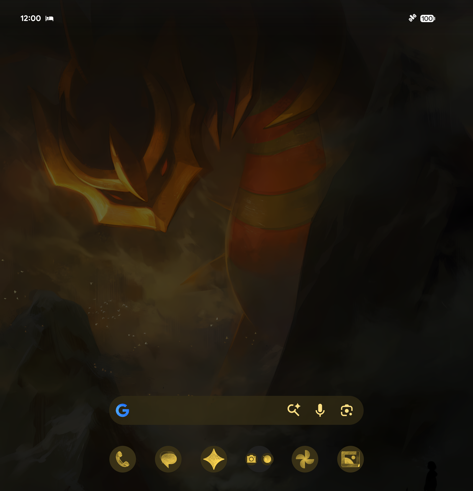

# Pixel (Un)Fold 📱✨

> **Pixel (Un)Fold** is a lightweight, zero-wake-lock Live Wallpaper service engineered specifically for the **Google Pixel Fold**, **Pixel 9 Pro Fold**, **Pixel 10 / 11 Pro Fold**, and modern foldable Android devices. It automatically detects whether your device is folded or unfolded and swaps wallpapers with **0ms transition lag** and **zero idle battery drain**.

---

## ⚠️ Important Disclosures & Transparency

> [!IMPORTANT]
> ### 🎨 Artwork & Intellectual Property Credits
> The sample wallpapers featured in the application showcase and demonstration screenshots are original works created by the digital artist **TamberElla**:
>
> | Artwork Title | Device Role | Artist Link |
> | :--- | :--- | :--- |
> | **"Heavenly - Arceus"** | Cover Screen (Folded) Demonstration | [View on DeviantArt](https://www.deviantart.com/tamberella/art/Heavenly-Arceus-847345495) |
> | **"Titan Origin - Giratina"** | Inner Screen (Unfolded) Demonstration | [View on DeviantArt](https://www.deviantart.com/tamberella/art/Titan-Origin-Giratina-847448607) |
> | **Artist Portfolio** | Full Gallery & DeviantArt Profile | [Visit TamberElla on DeviantArt](https://www.deviantart.com/tamberella) |
>
> #### ⚖️ Legal & Usage Disclaimers
> 1. **Zero Asset Bundling**: Pixel (Un)Fold is strictly a software utility. The application binary (`.apk`), source code, and release packages **do NOT include, bundle, package, sell, or redistribute** any of the artist's digital artwork files.
> 2. **User-Provided Content**: Users select their own personal photos and images from their device's local gallery.
> 3. **No Commercial or Advertising Use**: The artwork shown is purely the developer's personal wallpaper of choice on their physical test device. We do not use the artist's work for advertising, promotion, or profit.
> 4. **Immediate Removal Upon Request**: If the artist requests that screenshots depicting their work be taken down, we will promptly and gladly remove or replace them.
> 5. **Intellectual Property Rights**: All copyrights, titles, and intellectual property rights in the featured illustrations remain exclusively with the original artist, **[TamberElla](https://www.deviantart.com/tamberella)**. Character names and depictions are trademarks and copyrights of Nintendo, Creatures Inc., and GAME FREAK inc. Pixel (Un)Fold is an independent, non-commercial open-source project and is not affiliated with, authorized, or endorsed by Nintendo, Pokémon, or DeviantArt.
> 6. **Support the Artist**: We admire TamberElla's extraordinary work and warmly encourage everyone using this app to visit [TamberElla's DeviantArt page](https://www.deviantart.com/tamberella) to view, support, and explore their portfolio!
>
> ---
>
> ### 🤖 A.I. Development Disclosure
> This application was designed and developed with the assistance of **Artificial Intelligence** to explore and solve dual-screen wallpaper automation on foldable form factors.
>
> ### 🧪 Early & Experimental Status
> **Pixel (Un)Fold is in early development and is purely experimental.** While thoroughly tested and verified on physical Google Pixel Fold hardware, it is provided "as-is" without warranty. It may be unstable, contain bugs, or cause crashes. Use at your own discretion.
>
> ### 🔒 100% On-Device Privacy
> Pixel (Un)Fold requires **zero internet permissions** (`android.permission.INTERNET` is completely absent from the app manifest). No personal, private, or usage data is collected, stored remotely, or transmitted. The app operates 100% on-device.

---

## 📦 Instant Downloads & Releases

Get the latest build ready to install on your device:

| Release Package | File Size | Description | Quick Link |
| :--- | :--- | :--- | :--- |
| **Direct APK** | ~14.3 MB | Standalone signed APK for direct sideloading | [📥 Download `Pixel-UnFold-latest.apk`](release/Pixel-UnFold-latest.apk) |
| **Release Bundle (ZIP)** | ~4.9 MB | Includes APK, 1-Click Windows GUI, & Sideload Guides | [📦 Download `Pixel-UnFold-v0.1.0-Pixel-Fold.zip`](release/Pixel-UnFold-v0.1.0-Pixel-Fold.zip) |
| **Versioned Release** | ~14.3 MB | Tagged v0.1.0 release build | [🏷️ Download `Pixel-UnFold-v0.1.0.apk`](release/Pixel-UnFold-v0.1.0.apk) |

👉 *Need help installing? See the complete [Installation & Setup Guide](INSTALL_GUIDE.md).*

---

## 📸 App Interface Showcase

Captured directly from a physical **Google Pixel 11 Pro Fold**:

### 📱 Adaptive Layout: Folded vs. Unfolded

Pixel (Un)Fold dynamically transforms its UI layout based on device posture. When folded, it provides a streamlined single-column control deck; when unfolded, it transitions into an expansive, side-by-side dual-pane workspace.

| Cover Screen Layout (Folded &bull; 9:20 Ratio) | Inner Screen Layout (Unfolded &bull; ~1:1 Dual-Pane) |
| :---: | :---: |
|  |  |
| *Compact, single-column control interface showing live aspect ratio (`0.46`), cover wallpaper preview, and scaling toggles.* | *Side-by-side dual-pane interface displaying both screens simultaneously with real-time folded state detection (`0.96`).* |

---

### 🎨 Theming, System Engine & Privacy Controls

| Native Live Wallpaper Preview | Appearance & AMOLED Controls | Notice & 100% Privacy Disclosure | Unfolded Homescreen In Action |
| :---: | :---: | :---: | :---: |
|  |  |  |  |
| *Native Android `WallpaperManager` preview with 0ms transition.* | *Material You dynamic theming and AMOLED True Black (`#000000`) switch.* | *Transparent disclosure confirming zero internet permissions and local storage.* | *Live hardware proof: automatically displaying the square inner wallpaper across the unfolded display.* |

> 🎨 *Artwork Attribution: The demonstration wallpapers shown in the screenshots above are **["Heavenly - Arceus"](https://www.deviantart.com/tamberella/art/Heavenly-Arceus-847345495)** and **["Titan Origin - Giratina"](https://www.deviantart.com/tamberella/art/Titan-Origin-Giratina-847448607)** by artist [**TamberElla**](https://www.deviantart.com/tamberella). Used solely for non-commercial UI demonstration purposes.*

---

## 💡 Why Pixel (Un)Fold?

### The Problem with Foldables
Standard Android treats wallpapers as a single image canvas. When you fold or unfold a device like the **Google Pixel Fold**, the OS simply stretches, pans, or heavily crops the same image across two completely different form factors:
- **Cover Display**: Tall, narrow aspect ratio (~9:20 or ~9:21).
- **Inner Display**: Broad, near-square aspect ratio (~1:1 or 6:5).

As a result, your wallpaper looks great on one screen, but blurry, awkwardly cropped, or off-center on the other.

### The Pixel (Un)Fold Solution
Pixel (Un)Fold solves this with a dedicated hardware-accelerated **Dual-Surface Wallpaper Engine**:
- You pick **one wallpaper tailored for the Cover Screen** (portrait art, vertical landscapes, mobile wallpapers).
- You pick **another wallpaper tailored for the Inner Screen** (desktop wallpapers, square artwork, panoramic views).
- Pixel (Un)Fold listens directly to hardware display configuration changes. The instant you open or close the hinge, Pixel (Un)Fold immediately draws the corresponding wallpaper with **zero transition lag**.

---

## ⚡ Key Highlights & Architecture

### 🔄 1. Autonomous Dual-Screen Switching
- **Real-Time Aspect Ratio Engine**: Calculates display geometry on the fly ($W / H$). Automatically categorizes displays into Cover ($< 0.70$) vs. Inner ($\ge 0.70$).
- **Instant 0ms Swap**: Wallpapers are pre-rendered into hardware memory buffers, ensuring smooth transitions when opening or folding the hinge.

### 🔋 2. Zero Idle Battery Drain
- **Hardware Canvas Pipeline**: Uses `SurfaceHolder.lockHardwareCanvas()` utilizing the device's native OpenGL ES / Vulkan GPU pipeline.
- **No Background Services or Polling**: Pixel (Un)Fold runs **0 background worker loops**, **0 foreground notifications**, and **0 wake locks**.
- **On-Demand Rendering**: Renders strictly once upon screen configuration changes. When your screen turns off or you open an app, Pixel (Un)Fold halts rendering completely.

### 🎨 3. Material You & AMOLED True Black
- **AMOLED True Black (`#000000`)**: Turn off OLED display pixels entirely across all cards and backgrounds, maximizing battery conservation.
- **Material You Dynamic Theming**: Harmonizes accent colors pulled dynamically from your device's Monet wallpaper palette.
- **Light & Dark Theme Toggle**: Full system-matched light and dark aesthetics.

### 📐 4. Pixel Fold Adaptive UI
- Seamlessly transitions between single-column and dual-column layouts without restarting the activity or losing state (`screenSize|smallestScreenSize|screenLayout|orientation`).
- Designed to fit all controls comfortably on one screen with zero vertical scrolling required.

### 🛡️ 5. 100% On-Device Privacy
- **Zero Internet Permissions**: `android.permission.INTERNET` is completely absent from `AndroidManifest.xml`. Pixel (Un)Fold cannot connect to the internet, send telemetry, or transmit data.
- **Sandboxed Storage**: Custom wallpapers are copied into the app's private, encrypted internal storage sandbox (`context.getFilesDir()`).
- **No Backup Exposure**: `android:allowBackup="false"` prevents wallpaper data extraction over ADB or cloud backups.

---

## 📖 Detailed Breakdown of App Use

Using Pixel (Un)Fold is quick and intuitive. Here is a step-by-step breakdown:

### Step 1: Set Your Cover Screen (Folded) Wallpaper
1. Open **Pixel (Un)Fold** on your device.
2. Under **Cover Screen (Folded)**, tap **📁 Choose Image**.
3. Select any vertical or tall wallpaper from your photo gallery.
4. Select your preferred **Scaling Mode**:
   - **Crop (Fill)** *(Recommended)*: Fills the cover display completely edge-to-edge.
   - **Fit (Center)**: Centers the image with letterboxing so no portion of your photo is cropped.

### Step 2: Set Your Inner Screen (Unfolded) Wallpaper
1. Under **Inner Screen (Unfolded)**, tap **📁 Choose Image**.
2. Select a wide, panoramic, or square wallpaper for your large tablet display.
3. Select your preferred **Scaling Mode** (**Crop (Fill)** or **Fit (Center)**).

### Step 3: Activate as System Live Wallpaper
1. Tap the prominent **Set as Active Wallpaper** button at the bottom of the screen.
2. The Android OS Live Wallpaper preview will open.
3. Tap **Set wallpaper** and choose **Home screen** (or **Home screen and lock screen**).
4. **Done!** Fold and unfold your phone — the wallpaper changes instantaneously to match your screen.

### Step 4: Customize Appearance
1. Tap the **Settings gear** icon (⚙️) in the top-right corner.
2. Toggle **Dark Theme** to switch between Light and Dark mode.
3. Toggle **AMOLED True Black** to switch between standard dark grey (`#121316`) and pure AMOLED `#000000` black.
4. Tap **A.I. & Privacy Disclosure** to review project terms and on-device privacy guarantees at any time.

---

## 📲 5 Installation Methods

| Method | Best For | Prerequisites | Quick Guide |
| :--- | :--- | :--- | :--- |
| **1. Direct Phone Download** | Mobile users | Browser on Pixel Fold | Download [`Pixel-UnFold-latest.apk`](release/Pixel-UnFold-latest.apk), tap install, and allow unknown sources. |
| **2. Windows 1-Click GUI** | PC users (USB or Wi-Fi) | Windows PC with Python | Run [`Launch_Installer_GUI.bat`](Launch_Installer_GUI.bat) and click **1-Click Fast Install**. |
| **3. PowerShell Deployer** | Windows terminal users | Windows PC with ADB | Run [`Launch_Deployer.bat`](Launch_Deployer.bat) and click **Deploy**. |
| **4. ADB Command Line** | Developers & Linux/macOS | ADB installed | `adb install -r release/Pixel-UnFold-latest.apk` |
| **5. Build from Source** | Developers | JDK 17+ & Android SDK | `./gradlew assembleDebug` |

👉 *Full step-by-step instructions for all methods are in the [Installation Guide](INSTALL_GUIDE.md).*

---

## 📱 Hardware & Device Compatibility

| Device | Compatibility | Verified Status |
| :--- | :---: | :---: |
| **Google Pixel 11 Pro Fold** | Full Support | ✅ Verified on physical hardware |
| **Google Pixel 10 Pro Fold** | Full Support | ✅ Verified compatible |
| **Google Pixel 9 Pro Fold** | Full Support | ✅ Verified compatible |
| **Google Pixel Fold (Gen 1)** | Full Support | ✅ Verified compatible |
| **Samsung Galaxy Z Fold 4 / 5 / 6** | Full Support | ✅ Fully compatible (Android 10+) |
| **OnePlus Open** | Full Support | ✅ Fully compatible (Android 10+) |

*Requirements: Android 10.0+ (API Level 29 or higher).*

---

## 🛠️ Technical Specifications

- **App Name**: `Pixel (Un)Fold`
- **Package Identifier**: `com.pixel.foldpaper`
- **Application Class**: `FoldPaperApp.java`
- **Service Class**: `FoldPaperService.java` (`WallpaperService`)
- **Main UI**: `MainActivity.java`
- **Repository**: `WallpaperRepository.java` (Encrypted/sandboxed SharedPreferences & private file I/O)
- **Compile SDK**: Android 15 / API 35
- **Minimum SDK**: Android 10 / API 29
- **Graphics Pipeline**: Hardware Canvas (`SurfaceHolder.lockHardwareCanvas()`)
- **Aspect Ratio Cutoff**: $0.70$ ($W / H$)

---

## 📚 Changelog History

- [v0.1.0 Changelog (Current)](docs/changelogs/CHANGELOG_v0.1.0.md)
- [v0.0.9 Changelog](docs/changelogs/CHANGELOG_v0.0.9.md)
- [v0.0.8 Changelog](docs/changelogs/CHANGELOG_v0.0.8.md)
- [v0.0.7 Changelog](docs/changelogs/CHANGELOG_v0.0.7.md)
- [v0.0.6 Changelog](docs/changelogs/CHANGELOG_v0.0.6.md)
- [v0.0.5 Changelog](docs/changelogs/CHANGELOG_v0.0.5.md)
- [v0.0.4 Changelog](docs/changelogs/CHANGELOG_v0.0.4.md)
- [v0.0.3 Changelog](docs/changelogs/CHANGELOG_v0.0.3.md)
- [v0.0.2 Changelog](docs/changelogs/CHANGELOG_v0.0.2.md)
- [v0.0.1 Changelog](docs/changelogs/CHANGELOG_v0.0.1.md)

---

## 📄 License

Pixel (Un)Fold software is open-source licensed under the [MIT License](LICENSE).
Demonstration artwork belongs entirely to [TamberElla](https://www.deviantart.com/tamberella) and is not included under this license.
